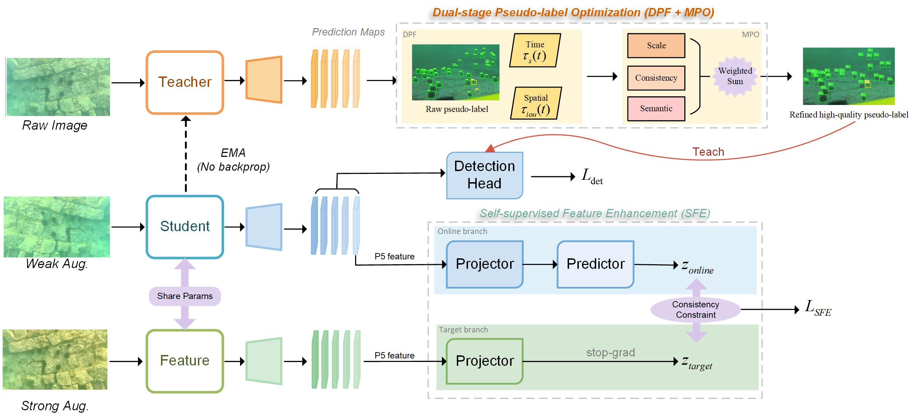

## Enhancing Underwater Object Detection through Hybrid Sparse-Annotation Optimization 
This repository contains the official implementation of the manuscript "Enhancing Underwater Object Detection through Hybrid Sparse-Annotation Optimization",submitted to *The Visual Computer*.
<p align="center">
  
</p>

## Layout

```
U-SHED/
├── train.py                   # Training entry point
├── train.sh                   # Training script
├── ushed/
│   ├── data/
│   │   └── duo.py             # DUO dataset loader + multi-branch sampler
│   ├── modeling/
│   │   ├── config.py           # Unified configuration (SFE / DPF / MPO)
│   │   ├── fcos.py            # FCOS backbone + DPF scheduling + MPO entry
│   │   ├── net.py             # Build Student/Teacher and inject SFE
│   │   ├── mpo.py             # MPO weight computation (scale/consistency/semantic)
│   │   ├── dpf.py             # DPF scheduler
│   │   └── factory.py         # Model factory components
│   └── config/
│       ├── schemas.py         # Configuration schemas
│       └── builder.py         # Configuration builder
├── enhancements/
│   ├── ssl/simplified_byol.py
│   ├── ssl/simplified_sfe.py
│   └── underwater/underwater_enhancement.py
├── datasets/DUO/              # (Optional) example dataset layout
├── pretrained_models/R-50.pkl # (Optional) example pretrained weights
├── requirements.txt            # Python dependencies
└── README.md
```

> To use your own data and weights, simply replace `datasets/` and `pretrained_models/` and set the environment variables.

## Environment

- Python ≥ 3.8, CUDA ≥ 11.0
- PyTorch ≥ 1.8
- cvpods (`git clone https://github.com/Megvii-BaseDetection/cvpods.git && pip install -e .`)
- Dependencies: `torchvision opencv-python numpy pycocotools matplotlib pillow`

```bash
pip install -r requirements.txt
```

## Pretrained Weights

This project supports using a ResNet-50 backbone pretrained on ImageNet.

You may download a Detectron2-style ResNet-50 checkpoint from: https://dl.fbaipublicfiles.com/detectron/ImageNetPretrained/MSRA/R-50.pkl

## Dataset
This project uses the DUO Underwater Object Detection Dataset, publicly available at: https://github.com/chongweiliu/DUO

The different sparse annotations are generated by us by randomly subsampling ground-truth boxes from the DUO training set, and are used to evaluate the performance under different annotation sparsity levels.


## Quick Start
**Launch training**
   ```bash
   cd /path/to/U-SHED
   python train.py --num-gpus 1
   ```
   
   Or use the provided training script:
   ```bash
   cd /path/to/U-SHED
   ./train.sh
   ```

## Citations
```
@article{
  title = {Enhancing Underwater Object Detection through Hybrid Sparse-Annotation Optimization},
  url={https://github.com/hheeaavveenn/USHED},
  journal = {The Visual Computer}   
}
```
